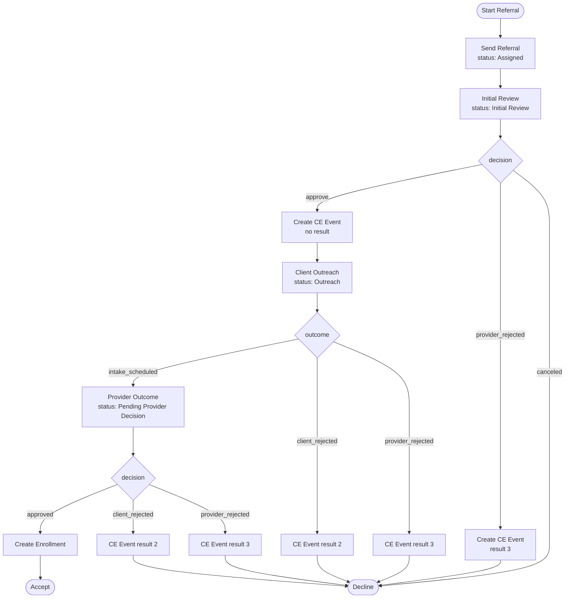

# AZ CE Workflows

## Overview
This directory contains utilities and workflow definitions specific to the AZ installation of Coordinated Entry (CE) workflows.

### Workflow Templates
- **MC Direct Referral**: Four sequential tasks (Send Referral → Initial Review → Client Outreach → Provider Outcome), with CE Event create/update and enrollment on accept.

### Usage
These workflows are generated and updated using the `CeWorkflows::Az::WorkflowBuilder` utility class.

**CAUTION:** Building these workflows deletes existing referrals and opportunities associated with the templates. Do not run in production after the first time.

These workflows expect client-specific forms to be available. The forms live under `form_data/az/ce_referral_steps/`. Load them with:

```bash
CLIENT=az rails driver:hmis:seed_definitions
```

or:

```ruby
HmisUtil::JsonForms.new(env_key: 'az', data_source_id: 1).seed_record_form_definitions(roles: [:CE_REFERRAL_STEP])
```

Then recreate the template:

```bash
rails driver:hmis:ce_define_az_workflows
```

After creating, attach the template on unit groups via `direct_referral_workflow_template_identifier = 'mc_direct_referral'`.

### MC Direct Referral Workflow



#### Updates

**Form definition updates**: Forms are managed in version control under `form_data/az/ce_referral_steps/`. Modify them in source control and re-seed.

**Workflow template updates**: See `CeWorkflows::Az::WorkflowBuilder` and `ce_define_az_workflows.rake`. Each local run deletes and recreates the template and associated referral data.
