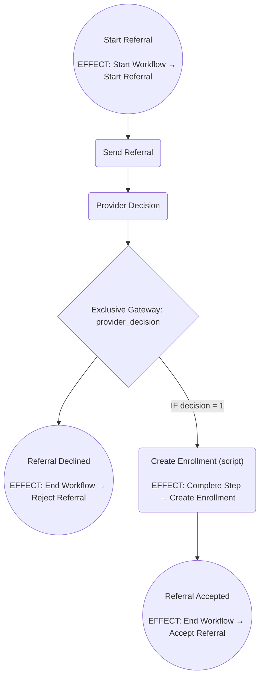

# PH CE Workflows

## Overview
This directory contains utilities and workflow definitions specific to the PH installation of Coordinated Entry (CE) workflows.

### Workflow Templates
- **Direct Referral Workflow**: Supports inter-project direct referrals.

### Usage
These workflows are generated using the `CeWorkflows::Ph::WorkflowBuilder` utility class.

These workflows expect client-specific forms to be available.

The forms can be loaded with `CLIENT=client rails driver:hmis:seed_definitions` or `HmisUtil::JsonForms.new(env_key: 'client').seed_record_form_definitions(roles: [:CE_REFERRAL_STEP])`

### Direct Referral Workflow

