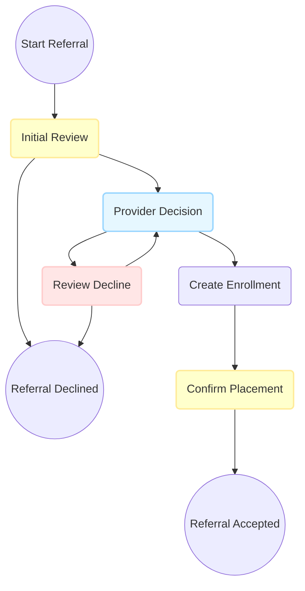

# Standard CE Workflows

## Overview
This directory contains utilities and workflow definitions for the Standard Referral CE workflow template.

This workflow is intended as an out-of-the-box baseline for QA, staging, demo, and new client onboarding. It can be customized per customer as needed.

### Workflow Templates
- **Standard Referral**: A baseline referral workflow with CE team initial review, provider decision, enrollment, placement confirmation, and decline review.

### Usage
These workflows are generated using the `CeWorkflows::Standard::WorkflowBuilder` utility class and the `ce_define_standard_workflows` rake task.

### Standard Referral Workflow
This is a simplified diagram of the standard referral workflow. To see the full generated diagram, run the Standard WorkflowBuilder or inspect the template mermaid output after running the rake task.

