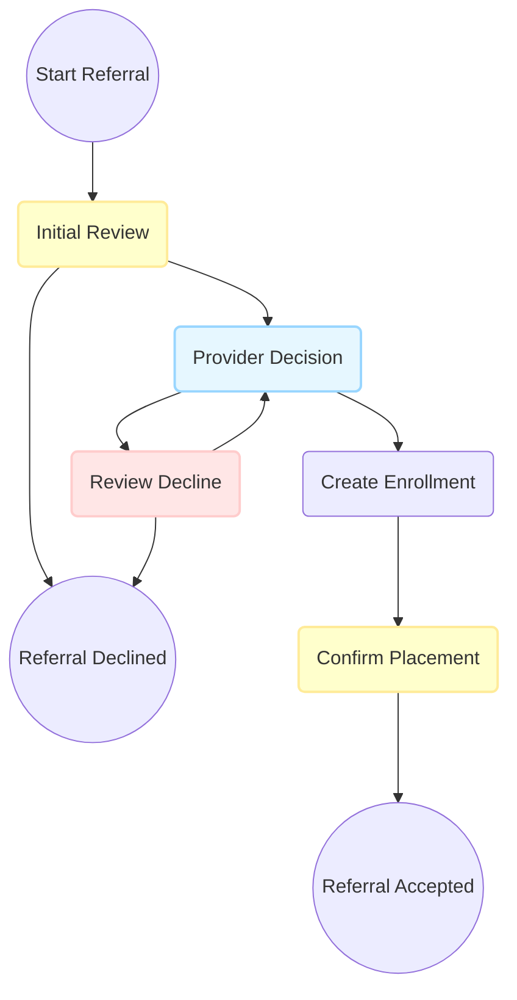

# Standard CE Workflows

## Overview
This directory contains utilities and workflow definitions for the Standard Referral CE workflow template.

This workflow is intended as an out-of-the-box baseline for QA, staging, demo, and new client onboarding. It can be customized per customer as needed.

### Workflow Templates
- **Standard Referral**: A baseline referral workflow with CE team initial review, provider decision, enrollment, placement confirmation, and decline review.

### Usage
These workflows are generated and updated using the `CeWorkflows::Standard::WorkflowBuilder` utility class and the `ce_define_standard_workflows` rake task. See usage comments on the rake task.

#### Updates

Updates to these workflows fall into two categories:

**Form definition updates**: Updates to the form definitions, such as adding a collected field or changing the text on a form label.
- These forms are managed in version control under `lib/form_data/default/ce_referral_steps/`.
- When the release containing those changes is deployed, the updated form definitions will be seeded automatically.

**Workflow template updates**: Updates to the workflow structure itself, including adding or removing nodes or modifying side effects.
- See `CeWorkflows::Standard::WorkflowBuilder` and `ce_define_standard_workflows.rake`.
- `build_standard_referral_workflow` hard-codes a version number and is intended to be idempotent on that version number. When run repeatedly, it updates the existing draft rather than creating a new template.
- When ready to publish, run the rake task with `PUBLISH=true`.
- After the template version has been published, the task will error if you try to publish again without bumping the version number.
- When ready to create a new draft version, manually bump the version number in `CeWorkflows::Standard::WorkflowBuilder`.
- To wipe and rebuild from scratch in a non-production environment, use `FORCE_RECREATE=true` (raises in production).

### Standard Referral Workflow
This is a simplified diagram of the standard referral workflow. To see the full generated diagram, run the rake task or Standard WorkflowBuilder.

