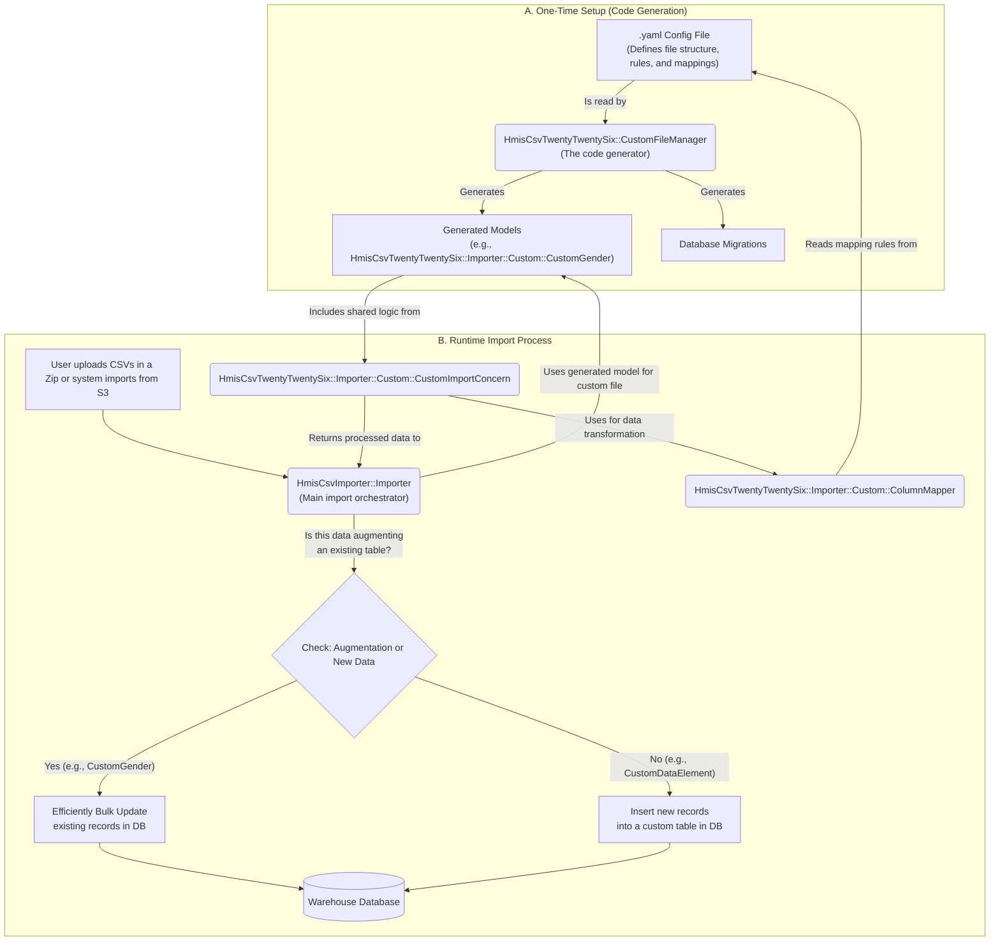

# HmisCsvTwentyTwentySix

## Overview

The `HmisCsvTwentyTwentySix` driver provides support for the FY2026 HUD HMIS CSV format. It integrates into the version-aware HMIS import pipeline, allowing it to automatically process standard HMIS CSV files as well as custom CSV files (like `CustomGender.csv` and `CustomDataElement.csv`) when FY2026 HMIS exports are uploaded.

The import system automatically detects the HMIS CSV version from the `Export.csv` file and routes to the appropriate loader and importer.

## Changes from FY2024

*   **Column Changes**
    *   **Client**
        *   Removed gender columns (Woman, Man, NonBinary, CulturallySpecific, Transgender, Questioning, DifferentIdentity, GenderNone, DifferentIdentityText)
        *   Added sex column (Sex)
    *   **Enrollment**
        *   Added V10 MentalHealthConsultation
        *   Removed R3 sexual orientation (SexualOrientation, SexualOrientationOther)
    *   **Service**
        *   Added InformationDate
*   Introduction of "dry-run" imports. These will **always** pause for review.

## Standard HMIS CSV Import

The driver handles both exporting and importing standard HMIS CSV files for the 2026 format.

### Exporter Module

The exporter module provides logic for exporting data into the HMIS CSV 2026 format.

`HmisCsvTwentyTwentySix::Exporter::Base.new(....).export!` will export a specified date range for specified projects.

### Importer Modules

The importer modules handle the processing of incoming HMIS CSV 2026 files. The process involves three main stages: loading, pre-processing, and ingestion.

1.  **Loader (`HmisCsvTwentyTwentySix::Loader`)**: Reads the source CSV files and inserts the raw data into data lake tables where all columns are stored as strings.
2.  **Importer (`HmisCsvTwentyTwentySix::Importer`)**: Processes the raw data from the loader.
    *   **Row Pre-Processing**: Consumes records from the loader, applies model-specific transformations (e.g., type casting, de-identification), and runs row-level validations.
    *   **Aggregated Pre-Processing**: Handles records that require aggregation before being processed.
    *   **Ingestion**: Merges the cleaned and validated records into the final warehouse tables.
3.  **Validation (`HmisCsvValidation`)**: A configurable rules engine to check for well-formedness of the imported data. Errors can be logged as warnings or can exclude a row from the import.

## Custom Files System

The custom files system allows for importing additional CSV files beyond the standard HUD HMIS specification.

### General Overview


### Quick Start

1.  **Create a YAML configuration file** in `drivers/hmis_csv_twenty_twenty_six/config/custom/`
2.  **Define your file structure** with columns, validations, and processing rules.
3.  **Run the bootstrap task** to generate model and migration files:
    ```bash
    dcr shell bundle exec rails r "HmisCsvTwentyTwentySix::CustomFileManager.bootstrap_custom_models!"
    ```
4.  **Run the generated migrations**:
    ```bash
    dcr shell bundle exec rails db:migrate:warehouse
    ```
5.  **Upload FY2026 HMIS CSV files**. Custom files included in the upload will be processed automatically.

### Configuration Structure

Custom files are defined via YAML configuration files.

```yaml
# custom_example.yaml
custom_files:
  - filename: "CustomExample.csv"
    class_name: "CustomExample"
    required: false
    description: "Example custom file for demonstration"

    # Choose ONE of these processing types:
    # Add data to existing rows in an existing table
    augments_warehouse_table: "GrdaWarehouse::Hud::Client"
    augment_key: "PersonalID"
    augment_import_class: "HmisCsvTwentyTwentySix::Importer::Client"

    # Own data for a given data source in a non-HUD table
    warehouse_class_name: "GrdaWarehouse::Hud::CustomExample"

    columns:
      - name: "PersonalID"
        type: "string"
        required: true
        validations: ["NonBlank"]
      - name: "CustomField"
        type: "integer"
        required: false
```

### Processing Types

#### 1. Augmentation Files

These files add data to existing warehouse tables. Use this for restoring fields that were removed from newer HMIS versions but still exist in the warehouse schema.

```yaml
# custom_gender.yaml
custom_files:
  - filename: "CustomGender.csv"
    class_name: "CustomGender"
    augments_warehouse_table: "GrdaWarehouse::Hud::Client"
    augment_key: "PersonalID"
    columns:
      # ...
```

#### 2. Warehouse Tables

These files own their own warehouse tables, similar to standard HUD files. Use this for completely new data types that don't fit into standard HMIS CSV tables.

```yaml
# custom_data_element.yaml
custom_files:
  - filename: "CustomDataElement.csv"
    class_name: "CustomDataElement"
    warehouse_class_name: "GrdaWarehouse::Hud::CustomDataElement"
    columns:
      # ...
```

### Column Mapping Types

You can define how data from a source column is mapped to the warehouse.

*   **Direct Mapping**: Maps the source value directly to a target column.
*   **Value-Based Multi-Column Mapping**: Maps different source values to different target columns.
*   **Concatenation Mapping**: Combines multiple source values into a single target field.

### Model and Migration Generation

The `HmisCsvTwentyTwentySix::CustomFileManager.bootstrap_custom_models!` task automatically generates the necessary model and migration files for your custom files based on your YAML configurations. The generated files for loaders and importers will be placed in the appropriate directories within the driver. These generated files should be committed to your repository.

### Best Practices

1.  **Use descriptive filenames** for your YAML configs.
2.  **Always validate required fields**.
3.  **Be explicit about data types**.
4.  **Handle missing files gracefully** with `required: false`.
5.  **Generate and commit models** after any change to the YAML files.
6.  **Test thoroughly**.
7.  **Document your additions**.
