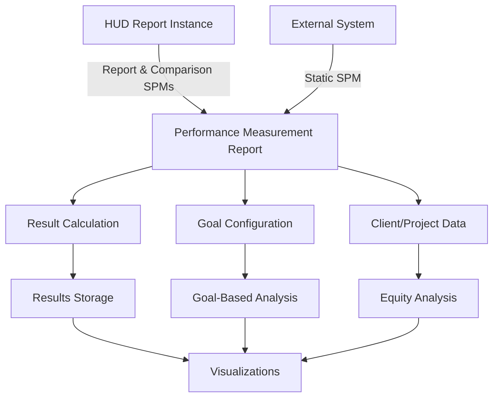
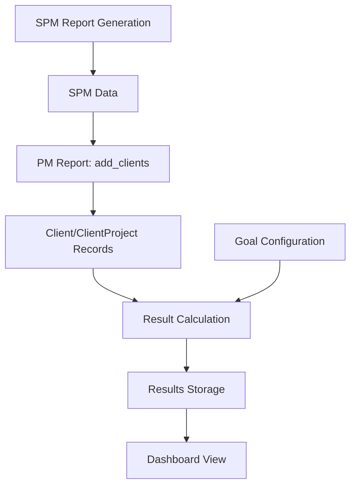

# Performance Measurement Dashboard

A comprehensive system for tracking, analyzing, and visualizing HUD System Performance Measures (SPM) with extended capabilities for longitudinal analysis and equity considerations.

## Overview

The Performance Measurement Dashboard extends the standard HUD System Performance Measures framework to provide:

1. **Longitudinal Analysis** - Track performance changes over time
2. **Goal-Based Comparisons** - Measure progress against defined targets
3. **Equity Analysis** - Break down metrics by demographic characteristics
4. **External Data Integration** - Compare with "static" SPM data from external systems

The report models persist performance data independent of the underlying SPM reports, allowing for historical analysis even if original reports are deleted.

The report is a summary view based primarily on SPM calculations, providing a one-year snapshot with comparison to the prior year. It runs with privileged access to include all relevant projects in the specified CoC(s), while limiting client-level drill-downs based on user project access permissions.

## High-Level System Architecture



## Detailed Data Flow



## Key Components

### Reports and Filtering

The system starts with a filter configuration that defines the scope of analysis:
- Date range (typically one year with prior year comparison)
- Project types
- CoC codes
- Other dimensional filters

### Data Model

The core data model consists of:

- **Report** - The central entity that organizes all performance data
- **Goal** - Defines targets for performance metrics
- **Result** - Stores calculated metrics at system and project levels
- **Client/ClientProject/Project** - Store detailed data for drill-down analysis

### Metric Types

The report supports two primary types of metrics:

1. **System-Level Metrics** - CoC-wide metrics derived directly from the SPM
2. **Project-Level Metrics** - Additional metrics calculated per project

## Implementation Details

### 1. SPM Report Generation

* The system first generates a standard HUD System Performance Measures report
* This creates SPM data in tables like Measure 1, Measure 2, etc.
* Data includes clients, enrollments, episodes, returns, etc.

### 2. PM Report Data Import (`add_clients`)

The `add_clients` method in `PerformanceMeasurement::Report` is the critical bridge between SPM data and the Performance Measurement system:

* Retrieves SPM data (enrollments, episodes, returns)
* Maps this data to PM-specific fields and clients
* Creates `Client` and `ClientProject` records

### 3. Configuration-driven Processing

The system uses several configuration hashes that define what data is extracted:

| Configuration | Purpose |
|--------------|---------|
| `spm_fields` | Maps SPM measures to PM client fields |
| `extra_calculations` | Adds data not directly from SPMs |
| `summary_calculations` | Derives additional metrics from collected data |
| `detail_hash` | Defines metrics that will be calculated |

### 4. Result Calculation Process

Once client data is stored, the `ResultCalculation` module creates the actual metrics:

1. For each metric defined in `detail_hash`
2. Pull relevant client data based on `calculation_column` specified in the metric
3. Perform calculations across system or project level
4. Compare against goals if applicable
5. Store in `Result` records

## Mapping Between Systems

### SPM to PM Client Fields

The data flow from SPM to PM happens in these key steps:

1. **SPM Report Generation**: Creates SPM enrollments/episodes with data from HMIS
2. **PM Data Extraction**: Uses `spm_fields` to map SPM data to PM client fields
   ```ruby
   spm_fields.each do |parts|
     cells = parts[:cells]  # e.g., [['1a', 'D2']]
     cells.each do |cell|
       members = cell_members(spec[:report], *cell)
       members.each do |member|
         # Maps data from SPM member to PM client fields
         # Creates PM Client, ClientProject records
       end
     end
   end
   ```
3. **Extra Data Computation**: Adds more data not in SPMs via `extra_calculations`
4. **Summary Field Derivation**: Uses `summary_calculations` to derive additional fields

### Client Fields to Metrics

After client data is stored, the system:

1. Uses `ResultCalculation` module's methods (one per metric)
2. Each method (e.g., `moved_in_positive_destinations`) extracts relevant client data
3. Calculates metrics based on the logic defined in `detail_hash`
4. Returns `Result` objects with calculated values

## Static SPM Support

The dashboard includes support for comparing against externally-generated SPMs through the Static SPM functionality, allowing communities to incorporate SPM data from outside their HMIS.

## Maintenance Considerations

When maintaining this system, pay attention to:

1. **SPM Specification Changes** - HUD periodically updates SPM definitions
2. **Metric Mappings** - The `detail_hash` in `Details` module defines metric properties
3. **Goal Configurations** - Goals may need adjustment to align with community priorities
4. **Data Transformations** - Complex logic in `ResultCalculation` module
