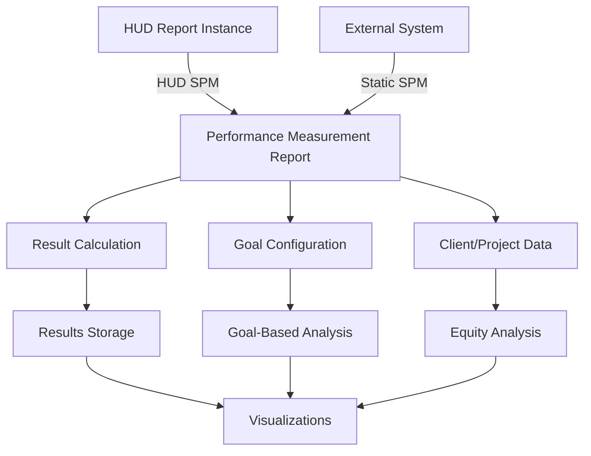

# Performance Measurement Dashboard

A comprehensive system for tracking, analyzing, and visualizing HUD System Performance Measures (SPM) with extended capabilities for longitudinal analysis and equity considerations.

## Overview

The Performance Measurement Dashboard extends the standard HUD System Performance Measures framework to provide:

1. **Longitudinal Analysis** - Track performance changes over time
2. **Goal-Based Comparisons** - Measure progress against defined targets
3. **Equity Analysis** - Break down metrics by demographic characteristics
4. **External Data Integration** - Compare with "static" SPM data from external systems

The report models persist performance data independent of the underlying SPM reports, allowing for historical analysis even if original reports are deleted.

The report is a summary view based primarily on SPM calculations, providing a one-year snapshot with comparison to the prior year. It runs with privileged access to include all relevant projects in the specified CoC(s), while limiting client-level drill-downs based on user project access permissions.

## System Architecture

## Key Components

### Reports and Filtering

The system starts with a filter configuration that defines the scope of analysis:
- Date range (typically one year with prior year comparison)
- Project types
- CoC codes
- Other dimensional filters

### Data Model

The core data model consists of:

- **Report** - The central entity that organizes all performance data
- **Goal** - Defines targets for performance metrics
- **Result** - Stores calculated metrics at system and project levels
- **Client/ClientProject/Project** - Store detailed data for drill-down analysis

### Metric Types

The report supports two primary types of metrics:

1. **System-Level Metrics** - CoC-wide metrics derived directly from the SPM
2. **Project-Level Metrics** - Additional metrics calculated per project

## Implementation Details

### Static SPM Support

The dashboard includes support for comparing against externally-generated SPMs through the Static SPM functionality, allowing communities to incorporate SPM data from outside their HMIS.

## Maintenance Considerations

When maintaining this system, pay attention to:

1. **SPM Specification Changes** - HUD periodically updates SPM definitions
2. **Metric Mappings** - The `detail_hash` in `Details` module defines metric properties
3. **Goal Configurations** - Goals may need adjustment to align with community priorities
4. **Data Transformations** - Complex logic in `ResultCalculation` module
5. **System vs. Project Metrics** - Ensure proper handling of CoC-level vs. project-level metrics
